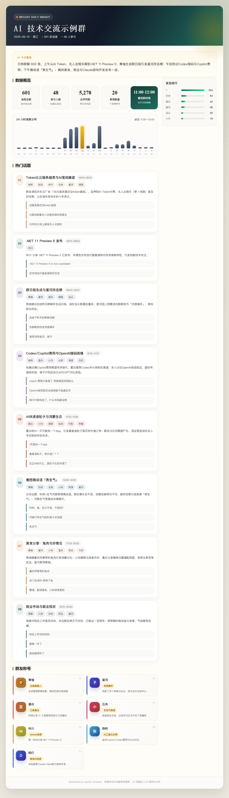
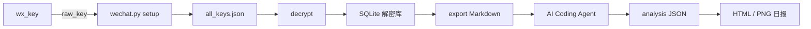
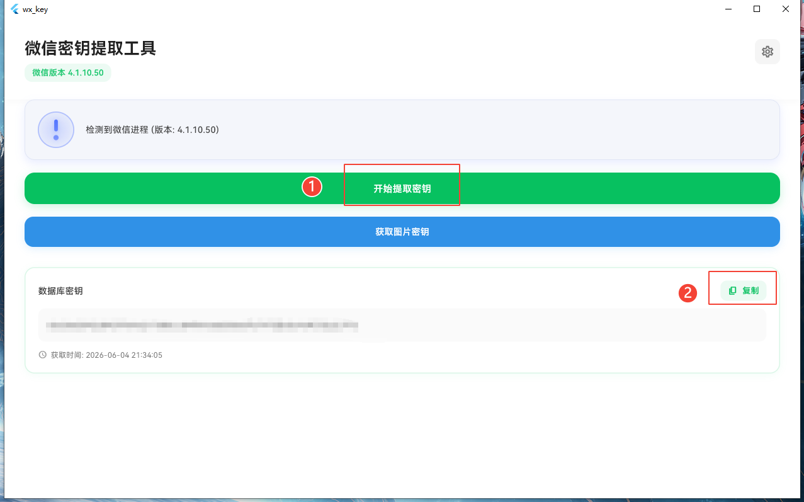

<p align="center">
  <a href="#效果预览">
    
  </a>
</p>

<h1 align="center">WeChatDaily</h1>

<p align="center">
  <b>本地解密微信群聊，AI Coding 生成可视化日报</b>
</p>

<p align="center">
  <a href="LICENSE"></a>
  <a href="https://www.python.org/"></a>
  
  
</p>

<p align="center">
  <a href="#效果预览">效果预览</a>
  ·
  <a href="#快速开始">快速开始</a>
  ·
  <a href="#agent-skill">Agent Skill</a>
  ·
  <a href="#日常使用">命令参考</a>
</p>

WeChatDaily 是一套 **Windows 本地工具链**：提取微信 4.1 密钥 → 解密数据库 → 导出群聊记录 → 由 **AI Coding 工具**（CLI / IDE 均可）通过内置 Skill 完成话题分析，渲染 Markdown / HTML / PNG 日报。

聊天记录解密在本机完成；**不内置 API Key 配置**，AI 分析由你使用的 AI Coding Agent 驱动。

---

## 效果预览

完整日报需走完 Skill 工作流（导出 → Agent 分析 → 渲染 HTML / PNG）。下面是匿名化示例，点击可打开完整 HTML：

<a href="docs/assets/report-preview.html">
  
</a>

> 示例素材来自匿名化后的本地日报，仅用于展示排版与信息结构。

---

## 核心特性

| | |
|---|---|
| **本地解密** | 基于 wx_key + WeChatDecrypt，数据不出本机 |
| **Skill 驱动** | 内置 Agent Skill，任意 AI Coding 工具加载即可用 |
| **可视化输出** | Markdown 导出 + HTML 精美排版 + 可选 PNG 长图 |
| **工具无关** | CLI、IDE、插件形式均可，不绑定特定编辑器 |

---

## 工作流架构



- `wx_key` 只负责提取微信本地 `raw_key`
- `WeChatDecrypt` 提供数据库解密、MCP 与媒体解码能力
- `wechat.py` 串联初始化、解密、群列表与 Markdown 导出
- AI Coding Agent 读取 Skill，完成话题分析并渲染 HTML / PNG

---

## 环境要求

| 项 | 要求 |
|---|---|
| 操作系统 | Windows |
| Python | **3.14+** |
| 微信 | 4.1+ 桌面版                                     |
| AI 分析 | 支持 Agent Skill 的 AI Coding 工具（CLI / IDE） |
| 可选 | Playwright Chromium（PNG 长图渲染） |

---

## 快速开始

按下面路径可以从零跑通：安装依赖 → 获取 `wx_key` → 配置密钥 → 交给 Agent 生成日报。

### 1. 克隆与安装

```bash
git clone <你的仓库地址>
cd WeChatDaily
git submodule update --init --recursive
pip install -r requirements.txt
```

复制环境模板：

```bat
copy .env.example .env
```

### 2. 下载 wx_key

wx_key 为第三方工具，**请从上游原地址下载**：

**推荐（手动）：** [wx_key v2.1.8 Release](https://github.com/ycccccccy/wx_key/releases/tag/v2.1.8) → 下载 `wx_key-windows-v2.1.8.zip` → 解压到 `tools/wx_key/`。

**可选（自动）：** 从同一上游地址拉取：

```bash
python wechat.py download-wx-key
```

### 3. 提取密钥并配置

1. 微信保持登录
2. 运行 `tools\wx_key\wx_key.exe`，复制 64 位 hex `raw_key` 到 `.env` 的 `WX_RAW_KEY`

<p align="center">
  
</p>

配置好 `.env` 后即可让 Agent 生成日报。首次使用或微信重启后，按 Agent 提示选择「刷新解密」即可；它会完成初始化、解密、导出与渲染流程。

> 如果只想手动验证解密流程，可参考下方「日常使用」中的命令参考。

### 4. 生成完整日报

在支持 Agent Skill 的 AI Coding 工具中加载本项目 Skill，对话说：

> 帮我生成「示例群①」今天的微信群日报

Agent 会按 Skill 工作流自动完成：确认群名与日期 →（按需）`setup` / `decrypt` → `export` 导出 Markdown → 话题分析 → 渲染 HTML / PNG。详见下方 **Agent Skill** 章节。

---

## Agent Skill

WeChatDaily 内置 Skill，供 **任意 AI Coding 工具**加载（CLI 或 IDE 均可）。由当前 Agent 阅读聊天记录并输出结构化 JSON，**无需配置 API Key**。

### Skill 位置

```text
.claude/skills/wechat-group-daily-report/
├── SKILL.md                    # Agent 工作流主文档
└── references/
    ├── analysis-prompt.md      # 结构化分析 Prompt
    └── env-setup.md            # .env 与密钥配置
```

> 不同工具对 Skill 目录的约定可能不同，将上述目录按你所用工具的文档放置即可。

### 何时触发

在 AI Coding 对话中提到：

- 微信群日报 / 群聊报告 / 群分析
- 导出群聊天记录 / 生成 HTML 群报

### 工作流概要

```text
确认群名 → 确认日期 → 是否刷新解密
    → export 导出 Markdown
    → Agent 分析 → 写入 analysis_*.json
    → render_manual_report.py 渲染 HTML + PNG
```

---

## 日常使用

### 命令参考

```bash
# 列出群聊
python wechat.py groups

# 导出指定群聊天记录（Markdown）
python wechat.py export --date 2026-06-12 --groups 示例群①,示例群②

# 导出时尽量拉全量消息（Skill 推荐）
python wechat.py export --date 2026-06-12 --groups 示例群① --limit 99999

# 重新解密
python wechat.py decrypt
```

`report` 为兼容旧命令，行为与 `export` 相同。

### 环境变量（`.env`）

| 变量 | 说明 |
|---|---|
| `WX_RAW_KEY` | wx_key 提取的 64 位 hex 密钥 |
| `WECHAT_DB_DIR` | 可选，db_storage 绝对路径 |
| `WECHAT_DEFAULT_GROUPS` | 可选，`export` 默认群（逗号分隔） |
| `WECHAT_SELF_NAME` | 可选，自己在报告中的显示名，默认「我」 |
| `WECHAT_DISPLAY_NAME_MODE` | 可选，`remark` 或 `nickname` |

### 一键导出脚本

```powershell
powershell -ExecutionPolicy Bypass -File run_report.ps1 --groups 示例群①
```

<details>
<summary><strong>PNG 长图渲染</strong></summary>

Skill 工作流最后一步可生成 PNG，需安装 Chromium：

```bash
python -m playwright install chromium
```

</details>

<details>
<summary><strong>Windows 定时任务（仅导出 MD）</strong></summary>

定时任务只能自动导出 Markdown；完整 HTML 日报仍需 AI Agent 分析。

```cmd
schtasks /create /tn "WeChatDaily" /tr "powershell -ExecutionPolicy Bypass -File D:\path\to\WeChatDaily\run_report.ps1 --groups 示例群①" /sc daily /st 22:00 /f
```

</details>

<details>
<summary><strong>MCP Server（WeChatDecrypt）</strong></summary>

可选：通过 MCP 让 Agent 直接查询解密库。

```json
{
  "mcpServers": {
    "wechat-decrypt": {
      "command": "python",
      "args": ["tools/wechat-decrypt/mcp_server.py"],
      "env": {
        "WECHAT_DECRYPT_APP_DIR": "tools/wechat-decrypt"
      }
    }
  }
}
```

</details>

---

## 目录结构

```text
WeChatDaily/
├── wechat.py                   # CLI 主入口（解密 + 导出）
├── run_report.ps1              # 一键导出脚本
├── .env.example                # 环境变量模板
├── LICENSE                     # MIT
├── scripts/
│   ├── download_wx_key.ps1
│   └── render_manual_report.py # Skill 渲染 HTML/PNG
├── docs/
│   └── assets/
│       ├── logo.png             # README 项目 Logo
│       ├── wx_key.png           # README wx_key 使用示意
│       ├── report-preview.html  # README 匿名化预览
│       └── report-preview.png
├── src/                        # 核心代码
├── tools/
│   ├── wx_key/                 # wx_key 二进制（本地，gitignore）
│   ├── wx_key.manifest.json
│   └── wechat-decrypt/         # git submodule
├── .claude/skills/             # Agent Skills
└── export/                     # 本地输出（gitignore）
```

---

## 注意事项

**勿提交以下文件：**

- `.env`
- `export/`
- `tools/wechat-decrypt/config.json`
- `tools/wx_key/`（从上游 Release 获取）

**wx_key 许可说明：** wx_key 版权归 [ycccccccy/wx_key](https://github.com/ycccccccy/wx_key) 所有，请从其 [GitHub Release](https://github.com/ycccccccy/wx_key/releases/tag/v2.1.8) 获取；WeChatDaily 代码以 MIT 发布，两者许可独立。

---

## 致谢

WeChatDaily 在以下开源项目基础上开发：

- **[wechat-analysis-action](https://github.com/NOBB2333/wechat-analysis-action)** by [@NOBB2333](https://github.com/NOBB2333) — 项目架构与串联思路的主要参考
- **[WeChatDecrypt](https://github.com/ylytdeng/wechat-decrypt)** — 数据库解密与 MCP 生态
- **[wx_key](https://github.com/ycccccccy/wx_key)** — Windows 微信 4.1 密钥提取（v2.1.8）

日报视觉结构参考了 astrbot 群日报插件思路。

---

## License

[MIT](LICENSE) © Bryan
